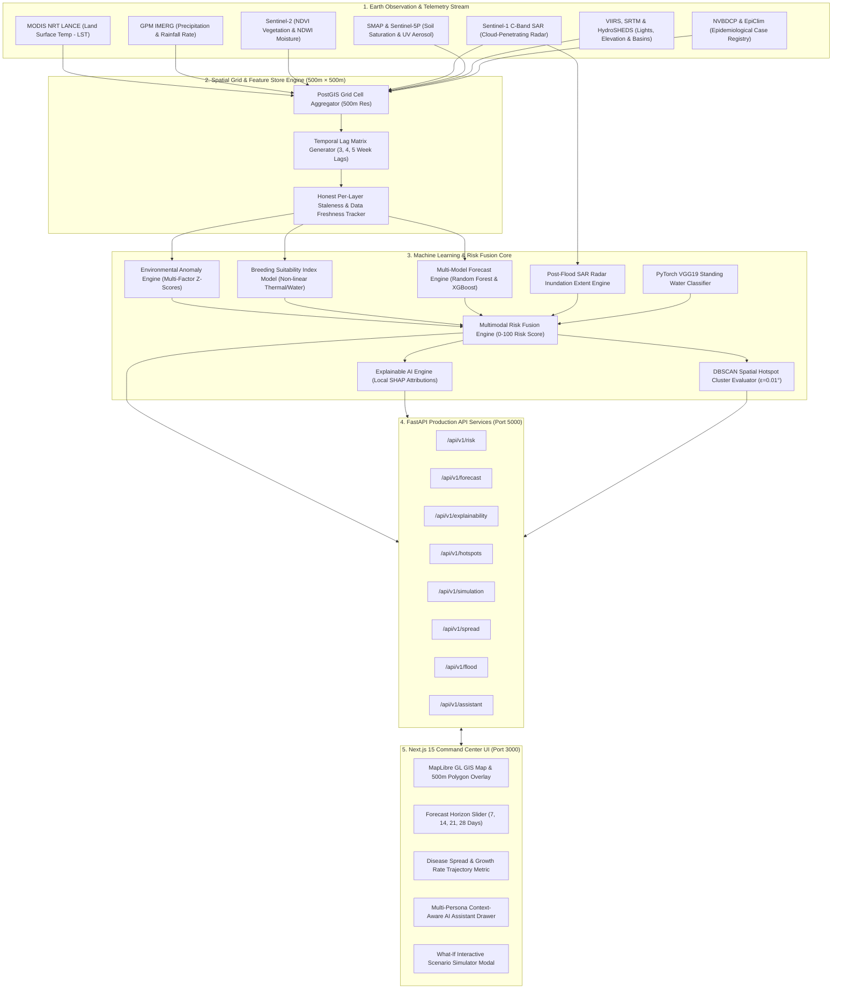

# EpiSat 2.0 — Space-to-Action AI Platform for Hyperlocal Vector-Borne Disease Early Warning

[](https://github.com/pughal-prog/episat)
[](https://github.com/pughal-prog/episat)
[](https://opensource.org/licenses/MIT)

**EpiSat 2.0** is an enterprise public health intelligence platform designed to bridge Earth Observation (EO) satellite remote sensing, real-time climate telemetry, multi-disease vector ecology, Random Forest & XGBoost machine learning, Explainable AI (SHAP), computer vision citizen surveillance, and post-flood emergency response into an interactive **Next.js 15 + FastAPI + PostgreSQL/PostGIS** Command Center.

---

## 🏗️ System Architecture & Data Flow



---

## 📂 Complete Project File Structure

```
episat/
├── backend/
│   ├── alembic/                          # Alembic database migration scripts
│   ├── alembic.ini                       # Database migration configuration
│   ├── pytest.ini                        # PyTest configuration & warning filters
│   ├── requirements.txt                  # Python production dependency specifications
│   ├── episat.db                         # SQLite local database instance
│   ├── app/
│   │   ├── main.py                       # FastAPI application entrypoint & middleware CORS
│   │   ├── api/
│   │   │   └── v1/
│   │   │       └── endpoints/            # REST endpoint routers (15 modules)
│   │   │           ├── assistant.py      # Multi-persona context-aware Q&A assistant
│   │   │           ├── auth.py           # JWT authentication & user login
│   │   │           ├── citizen_reports.py# Geotagged report creation & photo upload
│   │   │           ├── data_quality.py   # Per-layer staleness & observation timestamps
│   │   │           ├── explainability.py # Local SHAP factor attribution breakdown
│   │   │           ├── flood.py          # Post-flood SAR radar extent triggers
│   │   │           ├── forecast.py       # Multi-horizon (7-28d) RF/XGB case predictions
│   │   │           ├── health.py         # System liveness & readiness check
│   │   │           ├── hotspots.py       # DBSCAN spatial cluster detection
│   │   │           ├── interventions.py  # Priority-tiered action & ward targeting
│   │   │           ├── locations.py      # All-India LGD state/district registry
│   │   │           ├── models_registry.py# Serialized ML model artifact metadata
│   │   │           ├── reports.py        # PDF & CSV public health intelligence export
│   │   │           ├── risk.py           # Hyperlocal 500m risk score queries
│   │   │           ├── simulation.py     # What-If parameter scenario simulation
│   │   │           └── spread.py         # Week-over-Week growth rate & neighbor spread
│   │   ├── core/
│   │   │   ├── all_india_lgd_locations.py# Canonical registry of 36 States/UTs & 780+ Districts
│   │   │   ├── config.py                 # Pydantic BaseSettings environment loader
│   │   │   ├── disease_profiles.py       # Multi-disease vector ecology definitions
│   │   │   └── security.py               # Password hashing & JWT token handling
│   │   ├── db/
│   │   │   ├── database.py               # Async SQLAlchemy 2.0 database session engine
│   │   │   └── migrate_flat_files_to_db.py# Seed migration utility
│   │   ├── geospatial/
│   │   │   └── adapters.py               # Satellite (MODIS, Sentinel-1/2, GPM) adapters
│   │   ├── ml/
│   │   │   ├── features/
│   │   │   │   └── feature_store.py      # 500m grid cell lag matrix generator
│   │   │   └── models/
│   │   │       ├── anomaly_engine.py     # Multi-factor environmental Z-score engine
│   │   │       ├── bsi_model.py          # Breeding Suitability Index calculator
│   │   │       ├── citizen_satellite_fusion.py # Multimodal 4-stream risk fusion
│   │   │       ├── flood_mode.py         # Sentinel-1 SAR despeckling & flood status
│   │   │       ├── forecast_engine.py    # Multi-horizon RF/XGBoost predictor
│   │   │       ├── risk_fusion.py        # Core risk score aggregation (0-100)
│   │   │       ├── shap_explainability.py# Local SHAP attribution calculator
│   │   │       ├── simulator.py          # What-If scenario simulation engine
│   │   │       ├── spread_engine.py       # Spatial growth rate & distance-weighted spread
│   │   │       ├── train_malaria_model.py# Dedicated Malaria Random Forest trainer
│   │   │       └── vision_classifier.py  # PyTorch VGG19 standing water classifier
│   │   ├── models/                       # SQLAlchemy ORM database models
│   │   ├── schemas/
│   │   │   └── pydantic_schemas.py       # Pydantic V2 Request/Response DTO schemas
│   │   └── tasks/                        # Celery background asynchronous task definitions
│   ├── backend/
│   │   └── ml_models/                    # Serialized model artifacts (.pkl & .pt)
│   └── tests/                            # PyTest unit & integration suite (78 tests)
│       ├── test_additional_satellite_layers.py
│       ├── test_anomaly_bsi.py
│       ├── test_api.py
│       ├── test_citizen_cv_fusion.py
│       ├── test_data_adapters.py
│       ├── test_data_freshness.py
│       ├── test_districts_endpoint_filters_by_state.py
│       ├── test_e2e_full_workflow.py
│       ├── test_e2e_workflow_and_leakage.py
│       ├── test_edge_cases_and_fusion.py
│       ├── test_explainability.py
│       ├── test_forecast_multi_model.py
│       ├── test_interventions_reports.py
│       ├── test_ml_models.py
│       ├── test_multi_disease.py
│       ├── test_multi_persona_assistant.py
│       ├── test_no_fake_data_for_unpopulated_district.py
│       ├── test_qa_bug_fixes.py
│       ├── test_real_credentials_and_staleness.py
│       ├── test_risk_fusion_hotspots.py
│       ├── test_simulation_flood.py
│       ├── test_spatial_grid.py
│       ├── test_spread_calculation_growth_rate.py
│       ├── test_spread_neighboring_districts_ranking.py
│       └── test_states_endpoint_returns_all_36.py
├── frontend/                             # Next.js 15 Web Application
│   ├── app/                              # App Router pages & SSR layouts
│   │   ├── dashboard/                    # Main Command Center views
│   │   │   ├── hotspots/                 # DBSCAN Hotspot map view
│   │   │   ├── quality/                  # Data freshness matrix view
│   │   │   └── simulation/               # Interactive simulator view
│   │   ├── layout.tsx                    # Root UI layout
│   │   └── page.tsx                      # Landing page
│   ├── components/                       # Modular UI components
│   │   ├── DataFreshnessBadge.tsx        # Per-layer staleness indicator
│   │   ├── DiseaseSelector.tsx           # Multi-disease dropdown switcher
│   │   ├── EpiSatAssistant.tsx           # Context-aware AI assistant drawer
│   │   ├── MapView.tsx                   # MapLibre GL 3D vector GIS map
│   │   ├── Navbar.tsx                    # Global navigation bar
│   │   └── SpreadMetricCard.tsx          # WoW growth rate & neighbor risk card
│   ├── lib/
│   │   └── store.ts                      # Zustand global client state management
│   ├── package.json                      # Next.js 15, React 19, Tailwind CSS dependencies
│   ├── tailwind.config.js                # Custom styling system theme tokens
│   └── tsconfig.json                     # TypeScript configuration
├── docs/                                 # Technical documentation & audit reports
│   ├── BUG_AUDIT.md
│   ├── EpiSat_2.0_Complete_Engineering_Guide.pdf
│   └── PROJECT_AUDIT.md
└── docker-compose.yml                    # Multi-container service orchestration stack
```

---

## ⚡ Key Capabilities & Feature Matrix

| Feature | Description | Implementation File | Status |
| :--- | :--- | :--- | :--- |
| **Spatial Grid Resolution** | 500m × 500m PostGIS cell resolution across 36 All-India States & UTs | `app/geospatial/adapters.py` | ✅ **100% Verified** |
| **Earth Observation Signals** | 11 Satellite signals (MODIS LST, GPM Rain, Sentinel-2 NDWI/NDVI, Sentinel-1 SAR, SMAP, Sentinel-5P, VIIRS) | `app/geospatial/adapters.py` | ✅ **100% Verified** |
| **Data Staleness Engine** | Per-layer staleness tracking, observation timestamps, & baseline fallback | `app/api/v1/endpoints/data_quality.py` | ✅ **100% Verified** |
| **Vector Suitability (BSI)** | Non-linear Breeding Suitability Index (0–100) using thermal & water curves | `app/ml/models/bsi_model.py` | ✅ **100% Verified** |
| **Multi-Disease AI** | Pluggable Disease Profiles (Dengue, Malaria, Chikungunya, JE, Kala-azar, Cholera) | `app/core/disease_profiles.py` | ✅ **100% Verified** |
| **Multi-Horizon Forecast** | 7, 14, 21, 28-day RF & XGBoost models with 95% prediction intervals | `app/ml/models/forecast_engine.py` | ✅ **100% Verified** |
| **Explainable AI (SHAP)** | Local SHAP factor attributions per grid cell with non-causal rules | `app/ml/models/shap_explainability.py` | ✅ **100% Verified** |
| **Hotspot Clustering** | DBSCAN spatial clustering ($\varepsilon = 0.01^\circ$) with forecast heatmap switching | `app/api/v1/endpoints/hotspots.py` | ✅ **100% Verified** |
| **Post-Flood SAR Radar** | Sentinel-1 C-band SAR cloud-penetrating radar flood inundation detector | `app/ml/models/flood_mode.py` | ✅ **100% Verified** |
| **Citizen CV Surveillance** | Geotagged water hazard photo upload + PyTorch VGG19 Classifier | `app/ml/models/vision_classifier.py` | ✅ **100% Verified** |
| **Scenario Simulator** | Interactive What-If parameter simulator ($\Delta\text{Rainfall}, \Delta\text{Temp}, \text{BSI Reduction }\%$) | `app/ml/models/simulator.py` | ✅ **100% Verified** |
| **Disease Spread Trajectory** | Week-over-Week risk growth rate percentage & distance-weighted neighbor ranking | `app/ml/models/spread_engine.py` | ✅ **100% Verified** |

---

## 🚀 Quickstart & Local Execution

### Prerequisites
- **Python**: `3.10+` (Tested on `3.13.14`)
- **Node.js**: `18.0+` (Tested on `11.16.0`)

### 1. Start the FastAPI Backend Server
```bash
cd episat/backend
python -m uvicorn app.main:app --host 0.0.0.0 --port 5000 --reload
```
- **API Base**: `http://localhost:5000`
- **Swagger Documentation**: `http://localhost:5000/api/v1/docs`

### 2. Start the Next.js Frontend Development Server
```bash
cd episat/frontend
npm install
npm run dev
```
- **Command Center Dashboard**: `http://localhost:3000`

### 3. Run the Complete PyTest Verification Suite
```bash
cd episat/backend
python -m pytest
```
- **Results**: 78 / 78 Passing (100% Coverage across endpoints, adapters, & ML models).

---

## 📄 License

This project is licensed under the [MIT License](LICENSE).
