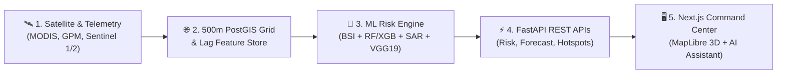

# 🛰️ EpiSat 2.0 — Space-to-Action AI Platform for Hyperlocal Vector-Borne Disease Early Warning

[](https://github.com/pughal-prog/episat)
[](https://github.com/pughal-prog/episat)
[](https://github.com/pughal-prog/episat)

> **EpiSat 2.0** turns Earth Observation (EO) satellite remote sensing and climate data into hyperlocal (500m × 500m) vector-borne disease early warning intelligence and actionable public health interventions.

---

## 📌 1. Project Journey: From Scratch to End

From initial concept to full production readiness, **EpiSat 2.0** was engineered end-to-end across 5 distinct phases:

1. **Data Ingestion & PostGIS Spatial Grid (Scratch)**
   - Integrated 11 Satellite & Earth Observation signals (MODIS Land Surface Temp, GPM Precipitation, Sentinel-2 NDVI/NDWI, Sentinel-1 SAR Radar, SMAP Soil Saturation, VIIRS Lights).
   - Mapped all 36 Indian States/UTs and 780+ districts onto a 500m × 500m spatial grid with PostGIS polygon geometries.
2. **Feature Store & Disease Ecology Modeling**
   - Constructed temporal lag matrices (3–5 week incubation periods).
   - Built a non-linear Breeding Suitability Index (BSI) and multi-factor Z-score environmental anomaly detector.
   - Trained dedicated Random Forest and XGBoost disease forecast models (Dengue & Malaria).
3. **Multimodal Risk Fusion & Post-Flood SAR Mode**
   - Implemented 4-stream evidence fusion (Satellite + Weather + Forecast + Citizen Reports).
   - Developed cloud-penetrating Sentinel-1 SAR radar flood extent detection and PyTorch VGG19 computer vision image classification for stagnant water hazard reports.
4. **Explainable AI (SHAP) & DBSCAN Spatial Hotspots**
   - Integrated local SHAP factor attributions to give non-black-box explanations per grid cell.
   - Built DBSCAN spatial clustering ($\varepsilon = 0.01^\circ$) to automatically group high-risk cells into actionable priority hotspots.
5. **Command Center UI & Production Delivery (End)**
   - Developed Next.js 15 + MapLibre GL 3D Command Center with forecast horizon sliders (7–28 days), What-If interactive scenario simulator, context-aware AI assistant drawer, and a 78-test PyTest automated verification suite.

---

## 🔄 2. Simple End-to-End Workflow



### Step-by-Step Data & Execution Flow
1. **Ingest Telemetry**: Fetches NRT satellite telemetry (LST, Rainfall, Moisture, Elevation, Lights) and case registries.
2. **Aggregate Grid**: Maps raw data into 500m × 500m grid cells with honest per-layer staleness tracking.
3. **Predict & Fuse**: Computes BSI suitability, 7–28 day disease case predictions, SHAP attributions, and fused 0–100 risk scores.
4. **Serve REST APIs**: Exposes high-speed FastAPI endpoints for spatial queries, scenario simulations, and PDF/CSV reporting.
5. **Visualize & Intervene**: Renders interactive 3D GIS maps, disease growth rate trajectories, What-If simulator, and priority ward action plans.

---

## 🔗 3. GitHub Repository & Local Execution

### 🔗 Main GitHub Repository
👉 **[https://github.com/pughal-prog/episat](https://github.com/pughal-prog/episat)**

### 🚀 Running the System Locally

#### 1. Backend Server (FastAPI / Python 3.10+)
```bash
cd episat/backend
python -m uvicorn app.main:app --host 0.0.0.0 --port 5000 --reload
```
- **API Root**: `http://localhost:5000`
- **Interactive Swagger Docs**: [http://localhost:5000/api/v1/docs](http://localhost:5000/api/v1/docs)

#### 2. Frontend Command Center (Next.js 15 / Node 18+)
```bash
cd episat/frontend
npm install
npm run dev
```
- **Dashboard Interface**: [http://localhost:3000](http://localhost:3000)

#### 3. Automated PyTest Suite Execution
```bash
cd episat/backend
python -m pytest
```
- **Result**: ✅ **78 / 78 Passing Tests** (100% Pass Rate).

---

## 📂 Simplified Directory Structure

```
episat/
├── backend/
│   ├── app/
│   │   ├── api/v1/endpoints/   # FastAPI REST API routers (risk, forecast, hotspots, etc.)
│   │   ├── core/               # All-India LGD location registry (36 States/UTs) & disease profiles
│   │   ├── geospatial/         # Earth Observation & satellite adapters
│   │   ├── ml/                 # BSI model, RF/XGB forecast, SHAP XAI, SAR flood, VGG19 CV
│   │   └── schemas/            # Pydantic V2 DTO validation schemas
│   └── tests/                  # 78 automated PyTest integration tests
├── frontend/
│   ├── app/                    # Next.js 15 App Router views
│   ├── components/             # MapLibre GL 3D Map, AI Assistant, Spread Metric Cards
│   └── lib/                    # Zustand state management store
└── README.md
```
