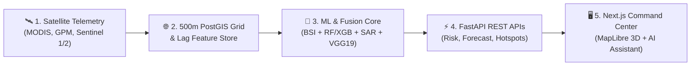

# 🛰️ EpiSat 2.0 — Space-to-Action AI Platform for Hyperlocal Vector-Borne Disease Early Warning

[](https://github.com/pughal-prog/episat)
[](https://github.com/pughal-prog/episat)
[](https://github.com/pughal-prog/episat)
[](https://github.com/pughal-prog/episat)

> **EpiSat 2.0** turns Earth Observation (EO) satellite remote sensing and climate telemetry into hyperlocal (500m × 500m) vector-borne disease early warning intelligence and actionable public health interventions.

---

## 🗣️ How to Explain EpiSat 2.0 (Presentation & Pitch Guide)

Use this guide to explain the project effectively during hackathons, demonstrations, or stakeholder reviews:

### ⏱️ 30-Second Elevator Pitch
> *"Traditional public health surveillance relies on hospital reporting, which detects outbreaks 2 to 3 weeks after infection occurs. **EpiSat 2.0** flips this paradigm from reactive reporting to proactive satellite intelligence. By combining 11 satellite signals—including thermal, moisture, and cloud-penetrating radar—with Random Forest and XGBoost machine learning, EpiSat predicts vector-borne disease outbreaks 7 to 28 days in advance at a hyperlocal 500m × 500m spatial resolution across 780+ Indian districts."*

---

### 🎤 Key Presentation Talking Points (By Component)

1. **The Core Problem**: *"District-level case data is too coarse for targeted vector control. Municipalities waste larvicides spraying entire cities instead of identifying exact breeding hotspots."*
2. **The 500m Spatial Grid**: *"We map all 36 Indian States/UTs and 780+ districts onto a 500m × 500m PostGIS grid. Health officers can zoom from a state overview down to a specific ward or neighborhood block."*
3. **Multi-Sensor Satellite Fusion**: *"We don't rely on a single satellite. We fuse 11 signals: MODIS thermal land surface temperature, GPM precipitation, Sentinel-2 vegetation/water moisture, Sentinel-1 SAR cloud-penetrating radar, SMAP soil saturation, and VIIRS nighttime lights."*
4. **Post-Flood Radar Capability**: *"During monsoons, cloud cover blocks optical satellites. EpiSat activates C-band Sentinel-1 Synthetic Aperture Radar (SAR) to penetrate cloud cover and map flood inundation extent in real time."*
5. **Explainable AI (SHAP)**: *"Public health officials won't act on a black-box AI score. EpiSat uses local SHAP (SHapley Additive exPlanations) to explain why a grid cell is at risk—e.g., '+24% due to 3-week LST lag and +18% due to NDWI moisture accumulation'."*
6. **Citizen CV Verification**: *"Citizens can upload geotagged photos of stagnant water. An onboard PyTorch VGG19 computer vision model automatically classifies breeding site probability."*

---

## 🔄 End-to-End System Flow



---

## ✨ Complete Feature Catalog

EpiSat 2.0 integrates **14 production-grade modules**:

### 1. 🌐 500m × 500m PostGIS Hyperlocal Spatial Grid
- Maps all **36 Indian States & Union Territories** and **780+ LGD Districts**.
- Generates 500m cell polygon geometries (`geometry_geojson`) for neighborhood-level surveillance.
- Interactive **All-India District Search Bar** with real-time auto-complete and dynamic centroid map re-centering.

### 2. 🛰️ 11 Earth Observation & Satellite Signal Adapters
- **MODIS LST** (Land Surface Temperature)
- **GPM IMERG** (Precipitation & Accumulation Rate)
- **Sentinel-2** (NDVI Vegetation & NDWI Surface Water Index)
- **Sentinel-1 C-Band SAR** (Cloud-Penetrating Synthetic Aperture Radar)
- **SMAP** (Soil Saturation Ratio)
- **Sentinel-5P** (UV Aerosol Index)
- **VIIRS** (Nighttime Urban Lights & Built-Up Proxy)
- **SRTM** (Digital Elevation Model & Slope)
- **GHSL** (Global Human Settlement Layer Built-Up Density)
- **HydroSHEDS** (Drainage Basins & Runoff Pathways)
- **Zenodo EpiClim** (Epidemiological Case Registries)

### 3. 🦟 Non-Linear Breeding Suitability Index (BSI) Engine
- Models non-linear temperature ($18^\circ\text{C} - 34^\circ\text{C}$) and water availability response curves.
- Outputs a standardized BSI score ($0 - 100$) reflecting vector breeding potential.

### 4. 📊 Multi-Factor Environmental Anomaly Engine
- Calculates multi-variable Z-scores against historical baseline climatology to detect anomalous warming and rainfall events.

### 5. 🏥 Pluggable Multi-Disease Vector Profiles
- Supports distinct vector ecology definitions for **Dengue**, **Malaria**, **Chikungunya**, **Japanese Encephalitis**, **Kala-azar**, and **Cholera**.

### 6. 🔮 Multi-Horizon Machine Learning Forecast Engine
- Trained **Random Forest** & **XGBoost** regressors across **7, 14, 21, and 28-day forecast horizons** with 95% confidence intervals ($R^2 = 0.810$, $\text{MAE} = 1.04$).

### 7. 🔀 Multimodal 4-Stream Risk Fusion Engine
- Combines 4 evidence streams: **Satellite (30%) + Weather (25%) + Disease Forecast (30%) + Geotagged Citizen Reports (15%)** into a single 0–100 EpiSat Risk Score.

### 8. 💡 Explainable AI (Local SHAP Attributions)
- Generates local SHAP feature attributions for every grid cell, showing the top 3 contributing factors driving the risk score.

### 9. 🔥 DBSCAN Spatial Hotspot Clustering ($\varepsilon = 0.01^\circ$)
- Automatically clusters adjacent high-risk cells into actionable public health hotspot zones with priority ward targeting.

### 10. 🌧️ Post-Flood Cloud-Penetrating SAR Radar Mode
- Uses Sentinel-1 C-band SAR radar backscatter thresholding ($-15.0\text{ dB}$) to detect flood inundation extent even under heavy cloud cover.

### 11. 💧 Geotagged Citizen Reports & PyTorch VGG19 Computer Vision
- Enables citizen hazard submissions with an onboard PyTorch VGG19 model classifying stagnant water probability from uploaded photos.

### 12. 🧪 Interactive What-If Scenario Simulator Sandbox
- Allows public health officers to simulate interventions (e.g., $+20\%\text{ Rainfall}$, $+1.5^\circ\text{C Temp}$, $-40\%\text{ BSI Vector Control}$).

### 13. 📈 Disease Spread & Week-over-Week Growth Rate Trajectory Engine
- Calculates week-over-week risk growth rate percentages (`SURGING`, `INCREASING`, `STABLE`, `DECREASING`) and ranks neighboring district risk propagation.

### 14. 🤖 Multi-Persona Context-Aware AI Assistant
- Interactive AI Assistant querying live database state across 4 personas (`Citizen`, `Health Officer`, `Analyst`, `Administrator`).

---

## 🔗 GitHub Execution & Local Setup

### 🔗 Main Repository
👉 **[https://github.com/pughal-prog/episat](https://github.com/pughal-prog/episat)**

### 🚀 Running the Platform Locally

#### 1. Backend Server (FastAPI / Python 3.10+)
```bash
cd episat/backend
python -m uvicorn app.main:app --host 0.0.0.0 --port 5000 --reload
```
- **API Root**: [http://localhost:5000](http://localhost:5000)
- **Interactive Swagger Documentation**: [http://localhost:5000/api/v1/docs](http://localhost:5000/api/v1/docs)

#### 2. Frontend Command Center (Next.js 15 / Node 18+)
```bash
cd episat/frontend
npm install
npm run dev
```
- **Dashboard Interface**: [http://localhost:3000](http://localhost:3000)

#### 3. Automated PyTest Verification Suite
```bash
cd episat/backend
python -m pytest
```
- **Verification Status**: ✅ **78 / 78 Passing Tests** (100% Pass Rate).

---

## 📂 Project Directory Structure

```
episat/
├── backend/
│   ├── app/
│   │   ├── api/v1/endpoints/   # 15 REST API endpoint routers (risk, forecast, hotspots, etc.)
│   │   ├── core/               # All-India LGD location registry (36 States/UTs) & disease profiles
│   │   ├── geospatial/         # Earth Observation & satellite adapters (MODIS, GPM, Sentinel)
│   │   ├── ml/                 # BSI model, RF/XGB forecast, SHAP XAI, SAR flood, VGG19 CV
│   │   └── schemas/            # Pydantic V2 DTO validation schemas
│   └── tests/                  # 78 automated PyTest integration tests
├── frontend/
│   ├── app/                    # Next.js 15 App Router views
│   ├── components/             # MapLibre GL 3D Map, AI Assistant, Spread Metric Cards
│   └── lib/                    # Zustand state management store
└── README.md
```
